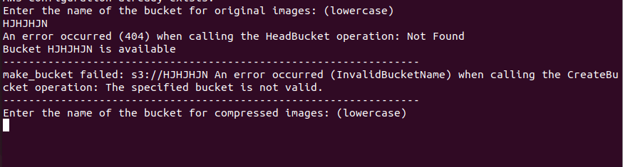
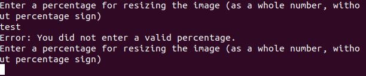

# M346 - Tests  

## Bucketname Grossschreibung

Der Bucketname muss am anfang klein geschrieben werden. Fals das nicht der Fall ist wird der Benutzer wieder aufgefordet für eine Wiedereingabe.

## invalide Verkleinerungsprozent eingabe

Wenn der Benutzer eine Invalide Prozenteingabe tätigt wird für eine ordentliche Eingabe aufgefordert.

## Wird Lambda-Function richtig erstellt konfiguriert?

In diesem Beispiel können wir erkennen, dass die existierende Lambda-Function gelöscht wurde und die neue erstellt und die richtige Konfiguration übergeben wurde.

